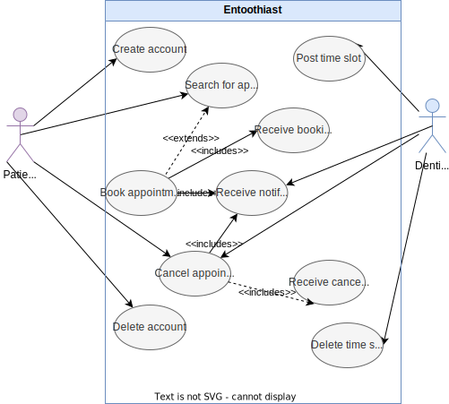

# Entoothiast

# Getting started

Recommended: Create a folder for the project and clone all repositories into it.

```bash
mkdir entoothiast
cd entoothiast

git clone git@git.chalmers.se:courses/dit355/2023/student-teams/dit356-2023-08/entoothiast.git
git clone git@git.chalmers.se:courses/dit355/2023/student-teams/dit356-2023-08/api-gateway.git
git clone git@git.chalmers.se:courses/dit355/2023/student-teams/dit356-2023-08/authentication-service.git
git clone git@git.chalmers.se:courses/dit355/2023/student-teams/dit356-2023-08/dentist-ui.git
git clone git@git.chalmers.se:courses/dit355/2023/student-teams/dit356-2023-08/logging-service.git
git clone git@git.chalmers.se:courses/dit355/2023/student-teams/dit356-2023-08/patient-ui.git
git clone git@git.chalmers.se:courses/dit355/2023/student-teams/dit356-2023-08/scheduling-service.git
git clone git@git.chalmers.se:courses/dit355/2023/student-teams/dit356-2023-08/statistics-service.git
```

## Generating & working with diagrams

We use d2lang to generate the component diagram, refer to the [d2 installation instructions](https://d2lang.com/tour/install)

## Use case diagram


# System architecture

## Component diagram


The booking subsystem uses MQTT for communication. To abstract the booking (backend) system, we "hide" it behind an API gateway, which the Patient UI and Dentist UI consume.

## Initial requirements
FR1: The system shall allow users to register accounts with the service.
USER STORY: As a user, I want to register an account with the service so that I can access the system.
ACCEPTANCE CRITERIA: 
1. The user can provide a valid email address and password for registration.
2. The user receives a confirmation email for account activation.
3. The user cannot register with an already registered email address.

FR2: The system shall allow users to log in securely to access the system.
USER STORY: As a user, I want to log in securely to access the system.
ACCEPTANCE CRITERIA: 
1. The user can enter their registered email and password for login.
2. The user is granted access to the system upon successful login.
3. The user receives an error message for invalid login credentials.

FR3: The system shall allow users to search for available dentist appointments.
USER STORY: As a user, I want to search for available dentist appointments.
ACCEPTANCE CRITERIA: 
1. The user can enter search criteria such as location or dentist name.
2. The system displays a list of available appointments matching the criteria.

FR4: The system shall allow users to specify a time window for their appointment search.
USER STORY: As a user, I want to specify a time window for my appointment search.
ACCEPTANCE CRITERIA: 
1. The user can specify a date range for the appointment search.
2. The system displays appointments within the specified time window.

FR5: The system shall display available appointment slots on a map.
USER STORY: As a user, I want to view available appointment slots on a map.
ACCEPTANCE CRITERIA: 
1. The user can access the map view displaying available appointment slots.
2. The map displays appointment slots as markers or pins with relevant information.

FR6: The system shall allow users to select and book an available appointment slot.
USER STORY: As a user, I want to select and book an available appointment slot.
ACCEPTANCE CRITERIA: 
1. The user can click on an available slot to initiate the booking process.
2. The user is provided with confirmation options for the selected slot.

FR7: The system shall allow users to select and book appointment slots from the map view.
USER STORY: As a user, I want to book appointment slots directly from the map view.
ACCEPTANCE CRITERIA: 
1. The user can click on a slot marker on the map to start the booking process.
2. The booking process is completed without leaving the map view.

FR8: The system shall allow users to receive a confirmation or rejection notification after booking an appointment.
USER STORY: As a user, I want to receive a confirmation or rejection notification after booking an appointment.
ACCEPTANCE CRITERIA: 
1. The user receives a confirmation email with appointment details upon successful booking.
2. The user receives a rejection notification if the slot is booked by someone else.

FR9: The system shall allow users to cancel appointments they have booked.
USER STORY: As a user, I want to cancel appointments I have booked.
ACCEPTANCE CRITERIA: 
1. The user can access their booked appointments and initiate cancellation.
2. The user receives a confirmation of appointment cancellation.

FR10: The system shall allow dentists to register their available time slots.
USER STORY: As a dentist, I want to register my available time slots.
ACCEPTANCE CRITERIA: 
1. The dentist can log in and access a calendar to register available time slots.
2. Registered slots are displayed to users searching for appointments.

FR11: The system shall allow dentists to receive notifications when their slots are booked or canceled.
USER STORY: As a dentist, I want to receive notifications when my slots are booked or canceled.
ACCEPTANCE CRITERIA: 
1. The dentist receives email or in-app notifications when a user books or cancels their slots.
2. Notifications include appointment details and user information.

FR12: The user interface shall include a map view of Gothenburg that can be navigated. 
USER STORY: As a user, I want to use the map view of Gothenburg to explore different areas.
ACCEPTANCE CRITERIA: 
1. The user can navigate the map view of Gothenburg.
2. The map allows panning and zooming to explore different areas.

FR13: Users shall be able to pan and zoom the Gothenburg map to explore different areas.
USER STORY: As a user, I want to pan and zoom the Gothenburg map for navigation.
ACCEPTANCE CRITERIA: 
1. The user can easily pan and zoom the map for better navigation.
2. The map view responds to gestures for panning and zooming.

FR14: The middleware layer shall persistently store appointment slots and appointments in a database.
USER STORY: As a developer, I want the middleware layer to persistently store appointment slots and appointments in a database.
ACCEPTANCE CRITERIA: 
1. The middleware layer successfully stores appointment slots and bookings in a database.
2. Data is retained even after the system restarts or crashes.

FR15: The middleware layer shall support messaging as an architectural paradigm to notify users and dentists.
USER STORY: As a developer, I want the middleware layer to support messaging as an architectural paradigm to notify users and dentists.
ACCEPTANCE CRITERIA: 
1. The middleware layer sends notifications to users and dentists when necessary events occur.
2. Notifications are delivered in a timely and reliable manner.

FR16: The user interface shall be equally usable on a range of devices, including desktop computers, mobile devices, and tablets.
USER STORY: As a user, I want the user interface to be equally usable on desktop computers, mobile devices, and tablets.
ACCEPTANCE CRITERIA: 
1. The user interface functions well and provides a consistent user experience on desktop, mobile, and tablet devices.
2. No critical usability issues or layout problems are observed on any of these devices.

FR17: The user interface shall be responsive and adapt to different screen sizes and resolutions.
USER STORY: As a user, I want the user interface to be responsive and adapt to different screen sizes and resolutions.
ACCEPTANCE CRITERIA: 
1. The user interface adapts to different screen sizes and resolutions without loss of functionality or readability.
2. Text and elements are appropriately scaled and arranged for different devices and orientations.
